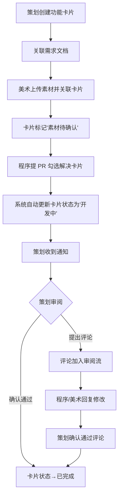
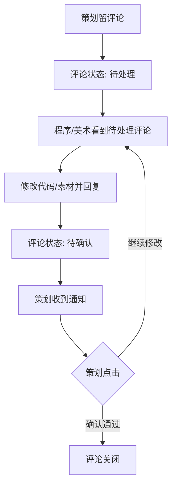

## 1. 产品概述

GameSync 是一款面向小型独立游戏团队的异地协作项目管理工具，核心诉求是"减少信息同步的损耗"。

- 解决策划需求文档程序看不到最新版、美术素材程序不知道去哪里下载、修好的 Bug 策划不验证就关了等信息同步痛点
- 目标用户为 4 人独立游戏团队（1 策划、2 程序、1 美术），让信息自动流转，团队成员"不用主动去同步，信息自己流过来"

## 2. 核心功能

### 2.1 用户角色

| 角色 | 注册方式 | 核心权限 |
|------|----------|----------|
| 策划 | 邀请注册 | 创建功能卡片、管理需求文档、审阅确认、查看同步墙 |
| 程序 | 邀请注册 | 关联代码提交、提 PR 关联功能卡片、回复审阅评论、查看同步墙 |
| 美术 | 邀请注册 | 上传美术素材、关联功能卡片、回复审阅评论、查看同步墙 |

### 2.2 功能模块

1. **登录/注册页**：团队邀请制注册、角色选择、JWT 认证
2. **同步墙（看板）**：所有功能卡片进度一览，进度由系统自动计算，不可手动拖拽
3. **功能卡片详情页**：需求文档、美术素材、代码提交记录的聚合视图，评论审阅流
4. **素材管理页**：美术素材上传、版本管理、依赖卡片标记
5. **Webhook 集成页**：Git 仓库 Webhook 配置、提交记录自动关联

### 2.3 页面详情

| 页面名称 | 模块名称 | 功能描述 |
|----------|----------|----------|
| 登录/注册页 | 登录表单 | 邮箱密码登录，角色标识展示 |
| 登录/注册页 | 注册表单 | 邀请码注册，选择角色（策划/程序/美术） |
| 同步墙 | 卡片看板 | 按状态分列展示所有功能卡片，进度条自动计算 |
| 同步墙 | 筛选过滤 | 按角色、状态、优先级筛选卡片 |
| 同步墙 | 实时通知 | 红点提示新变更，WebSocket 推送 |
| 功能卡片详情 | 需求文档区 | 策划编写/编辑需求，显示版本历史 |
| 功能卡片详情 | 素材关联区 | 已关联的美术素材列表，上传新素材入口 |
| 功能卡片详情 | 代码提交区 | 已关联的 PR/提交记录列表，自动从 Webhook 同步 |
| 功能卡片详情 | 评论审阅流 | 异步评论、回复、确认通过工作流 |
| 功能卡片详情 | 状态时间线 | 卡片状态变更历史，自动记录触发原因 |
| 素材管理页 | 素材上传 | 拖拽上传，自动生成缩略图，支持版本覆盖 |
| 素材管理页 | 依赖标记 | 上传后标记关联的功能卡片，系统自动通知卡片状态变更 |
| Webhook 集成页 | Webhook 配置 | 添加 Git 仓库 URL、生成 Webhook 密钥 |
| Webhook 集成页 | 提交记录 | 展示已接收的 Webhook 事件和关联结果 |

## 3. 核心流程

### 3.1 功能卡片全生命周期

策划创建功能卡片 → 关联需求文档 → 美术上传素材并关联 → 卡片标记"素材待确认" → 程序提 PR 勾选卡片 → 系统自动更新卡片状态 → 策划收到通知 → 策划审阅确认 → 卡片完成

### 3.2 异步审阅流程

策划留评论 → 程序/美术看到待处理评论 → 修改代码/素材并回复 → 策划收到通知 → 策划点"确认通过" → 评论关闭

### 3.3 自动状态计算

同步墙中每张卡片的进度由以下因素自动计算：
- 需求文档是否已填写（20%）
- 美术素材是否已上传且确认（30%）
- 代码 PR 是否已提交且关联（30%）
- 审阅评论是否全部关闭（20%）

## 4. 用户界面设计

### 4.1 设计风格

- **主色调**：深色背景 (#0f1117) + 青绿强调色 (#00d4aa)，搭配暗紫辅助色 (#7c5cfc)
- **次色调**：策划角色标识橙色 (#ff8c42)、程序角色标识蓝色 (#4dabf7)、美术角色标识粉色 (#f06595)
- **按钮风格**：圆角微凸 3D 按钮，主操作用强调色填充，次操作用边框线
- **字体**：标题用 "Outfit"（几何感现代字体），正文用 "DM Sans"（清晰可读）
- **布局风格**：左侧导航栏 + 主内容区，卡片式布局，同步墙采用看板列布局
- **图标**：Lucide 图标库，线性风格，与深色主题一致

### 4.2 页面设计概览

| 页面名称 | 模块名称 | UI 元素 |
|----------|----------|----------|
| 登录/注册页 | 登录表单 | 居中卡片、深色背景、青绿渐变按钮、角色图标选择 |
| 同步墙 | 卡片看板 | 四列看板（需求中/开发中/待确认/已完成）、进度条、状态标签、角色头像 |
| 功能卡片详情 | 需求文档区 | 富文本编辑区、版本切换下拉、自动保存指示 |
| 功能卡片详情 | 素材关联区 | 素材缩略图网格、上传拖拽区、版本标记 |
| 功能卡片详情 | 代码提交区 | 提交记录列表、PR 状态徽章、关联按钮 |
| 功能卡片详情 | 评论审阅流 | 时间线布局、待处理/待确认标签、确认通过按钮 |
| 素材管理页 | 素材网格 | 大尺寸缩略图、版本下拉、关联卡片标签 |
| Webhook 集成页 | 配置表单 | 仓库 URL 输入框、密钥展示、事件日志列表 |

### 4.3 响应式设计

- 桌面优先设计，同步墙看板在宽屏上四列并排
- 中等屏幕（平板）看板可横向滚动
- 移动端切换为单列列表视图，导航栏收起为底部标签栏

### 4.4 不同角色界面差异

- **策划**：首页默认显示同步墙 + 待审阅评论列表，功能卡片创建按钮突出，需求文档编辑权限
- **程序**：首页默认显示待处理 PR 关联 + 代码提交相关卡片，PR 关联操作入口
- **美术**：首页默认显示素材上传入口 + 待确认素材列表，素材管理功能突出
