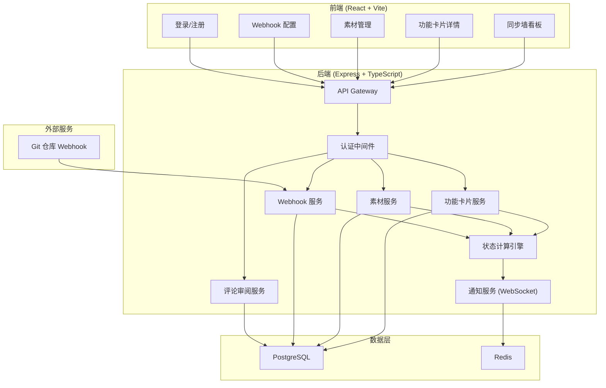
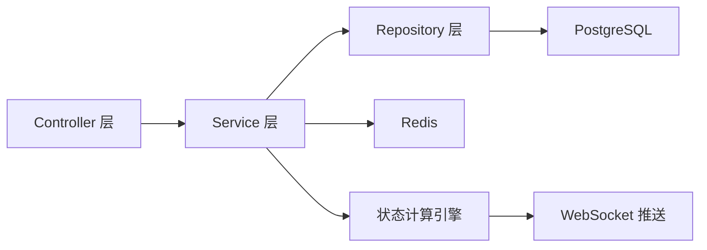
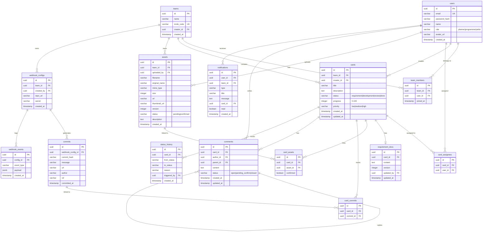

## 1. 架构设计



## 2. 技术说明

- **前端**: React@18 + TailwindCSS@3 + Vite + Zustand (状态管理) + React Router DOM
- **初始化工具**: Vite Init (react-express-ts 模板)
- **后端**: Express@4 + TypeScript (ESM)
- **数据库**: PostgreSQL (核心数据) + Redis (实时通知/缓存/会话)
- **实时通信**: WebSocket (ws 库)，通过 Redis Pub/Sub 支持多实例
- **文件上传**: Multer (素材上传至本地 uploads 目录)

## 3. 路由定义

| 路由 | 用途 |
|------|------|
| `/login` | 登录页面 |
| `/register` | 注册页面（邀请码） |
| `/` | 同步墙看板主页 |
| `/card/:id` | 功能卡片详情页 |
| `/card/new` | 创建新功能卡片 |
| `/assets` | 素材管理页 |
| `/webhooks` | Webhook 集成配置页 |
| `/notifications` | 通知中心 |

## 4. API 定义

### 4.1 认证相关

```typescript
// POST /api/auth/register
interface RegisterRequest {
  email: string
  password: string
  name: string
  role: 'planner' | 'programmer' | 'artist'
  inviteCode: string
}
interface RegisterResponse {
  token: string
  user: { id: string; email: string; name: string; role: string }
}

// POST /api/auth/login
interface LoginRequest {
  email: string
  password: string
}
interface LoginResponse {
  token: string
  user: { id: string; email: string; name: string; role: string }
}

// GET /api/auth/me
interface MeResponse {
  user: { id: string; email: string; name: string; role: string }
}
```

### 4.2 功能卡片

```typescript
// GET /api/cards
interface CardListResponse {
  cards: Card[]
}
interface Card {
  id: string
  title: string
  description: string
  status: 'requirement' | 'development' | 'review' | 'done'
  progress: number // 0-100, 自动计算
  priority: 'low' | 'medium' | 'high'
  creatorId: string
  assignees: { id: string; role: string; name: string }[]
  requirementDocId: string | null
  assets: AssetReference[]
  commits: CommitReference[]
  pendingReviewCount: number
  createdAt: string
  updatedAt: string
}

// POST /api/cards
interface CreateCardRequest {
  title: string
  description: string
  priority: 'low' | 'medium' | 'high'
}

// PUT /api/cards/:id
interface UpdateCardRequest {
  title?: string
  description?: string
  priority?: 'low' | 'medium' | 'high'
}

// GET /api/cards/:id
interface CardDetailResponse {
  card: Card
  requirementDoc: RequirementDoc | null
  assets: Asset[]
  commits: Commit[]
  comments: Comment[]
  statusHistory: StatusHistory[]
}
```

### 4.3 需求文档

```typescript
// PUT /api/cards/:id/requirement
interface UpdateRequirementRequest {
  content: string // markdown 格式
}
interface RequirementDoc {
  id: string
  cardId: string
  content: string
  version: number
  updatedAt: string
  updatedBy: string
}

// GET /api/cards/:id/requirement/versions
interface RequirementVersionsResponse {
  versions: { version: number; updatedAt: string; updatedBy: string }[]
}
```

### 4.4 美术素材

```typescript
// POST /api/assets/upload
interface UploadAssetRequest {
  file: File
  cardIds: string[]
  description: string
}
interface Asset {
  id: string
  filename: string
  originalName: string
  mimeType: string
  size: number
  url: string
  thumbnailUrl: string
  version: number
  uploadedBy: string
  cardIds: string[]
  status: 'pending' | 'confirmed'
  createdAt: string
}

// PUT /api/assets/:id/confirm
interface ConfirmAssetRequest {
  cardId: string
}

// GET /api/assets
interface AssetListResponse {
  assets: Asset[]
}
```

### 4.5 代码提交 / Webhook

```typescript
// POST /api/webhooks/config
interface CreateWebhookConfigRequest {
  repoUrl: string
  secret: string
}
interface WebhookConfig {
  id: string
  repoUrl: string
  secret: string
  createdBy: string
  createdAt: string
}

// POST /api/webhooks/git/:configId
// Git 仓库推送的 Webhook 回调
interface GitWebhookPayload {
  ref: string
  commits: { id: string; message: string; url: string; author: string }[]
  pull_request?: {
    id: number
    title: string
    url: string
    body: string // 从 body 解析 "Closes #卡片ID" 或 "Fixes #卡片ID"
  }
}

// GET /api/webhooks/events
interface WebhookEventListResponse {
  events: WebhookEvent[]
}
interface WebhookEvent {
  id: string
  configId: string
  eventType: string
  payload: object
  linkedCardIds: string[]
  createdAt: string
}
```

### 4.6 评论审阅

```typescript
// POST /api/cards/:id/comments
interface CreateCommentRequest {
  content: string
  parentCommentId?: string
}
interface Comment {
  id: string
  cardId: string
  authorId: string
  authorName: string
  authorRole: string
  content: string
  status: 'open' | 'pending_confirm' | 'closed'
  parentCommentId: string | null
  replies: Comment[]
  createdAt: string
}

// PUT /api/comments/:id/reply
interface ReplyCommentRequest {
  content: string
}

// PUT /api/comments/:id/confirm
interface ConfirmCommentRequest {
  // 策划确认通过，无需额外字段
}

// GET /api/cards/:id/comments
interface CommentListResponse {
  comments: Comment[]
}
```

### 4.7 通知

```typescript
// GET /api/notifications
interface NotificationListResponse {
  notifications: Notification[]
  unreadCount: number
}
interface Notification {
  id: string
  type: 'card_status_changed' | 'asset_uploaded' | 'comment_added' | 'comment_confirmed' | 'pr_linked'
  title: string
  message: string
  cardId: string | null
  read: boolean
  createdAt: string
}

// PUT /api/notifications/:id/read
// PUT /api/notifications/read-all

// WebSocket 事件
interface WSNotification {
  type: string
  payload: Notification
}
```

## 5. 服务端架构图



## 6. 数据模型

### 6.1 数据模型定义



### 6.2 数据定义语言

```sql
CREATE EXTENSION IF NOT EXISTS "uuid-ossp";

CREATE TABLE teams (
    id UUID PRIMARY KEY DEFAULT uuid_generate_v4(),
    name VARCHAR(100) NOT NULL,
    invite_code VARCHAR(20) UNIQUE NOT NULL DEFAULT upper(substring(md5(random()::text) from 1 for 8)),
    creator_id UUID,
    created_at TIMESTAMP WITH TIME ZONE DEFAULT NOW()
);

CREATE TABLE users (
    id UUID PRIMARY KEY DEFAULT uuid_generate_v4(),
    email VARCHAR(255) UNIQUE NOT NULL,
    password_hash VARCHAR(255) NOT NULL,
    name VARCHAR(100) NOT NULL,
    role VARCHAR(20) NOT NULL CHECK (role IN ('planner', 'programmer', 'artist')),
    avatar_url VARCHAR(500),
    created_at TIMESTAMP WITH TIME ZONE DEFAULT NOW()
);

CREATE TABLE team_members (
    id UUID PRIMARY KEY DEFAULT uuid_generate_v4(),
    team_id UUID NOT NULL REFERENCES teams(id) ON DELETE CASCADE,
    user_id UUID NOT NULL REFERENCES users(id) ON DELETE CASCADE,
    joined_at TIMESTAMP WITH TIME ZONE DEFAULT NOW(),
    UNIQUE(team_id, user_id)
);

CREATE TABLE cards (
    id UUID PRIMARY KEY DEFAULT uuid_generate_v4(),
    team_id UUID NOT NULL REFERENCES teams(id) ON DELETE CASCADE,
    creator_id UUID NOT NULL REFERENCES users(id),
    title VARCHAR(200) NOT NULL,
    description TEXT DEFAULT '',
    status VARCHAR(20) NOT NULL DEFAULT 'requirement' CHECK (status IN ('requirement', 'development', 'review', 'done')),
    progress INTEGER NOT NULL DEFAULT 0 CHECK (progress >= 0 AND progress <= 100),
    priority VARCHAR(10) NOT NULL DEFAULT 'medium' CHECK (priority IN ('low', 'medium', 'high')),
    created_at TIMESTAMP WITH TIME ZONE DEFAULT NOW(),
    updated_at TIMESTAMP WITH TIME ZONE DEFAULT NOW()
);

CREATE TABLE card_assignees (
    id UUID PRIMARY KEY DEFAULT uuid_generate_v4(),
    card_id UUID NOT NULL REFERENCES cards(id) ON DELETE CASCADE,
    user_id UUID NOT NULL REFERENCES users(id) ON DELETE CASCADE,
    UNIQUE(card_id, user_id)
);

CREATE TABLE requirement_docs (
    id UUID PRIMARY KEY DEFAULT uuid_generate_v4(),
    card_id UUID NOT NULL REFERENCES cards(id) ON DELETE CASCADE,
    content TEXT DEFAULT '',
    version INTEGER NOT NULL DEFAULT 1,
    updated_by UUID NOT NULL REFERENCES users(id),
    updated_at TIMESTAMP WITH TIME ZONE DEFAULT NOW()
);

CREATE TABLE assets (
    id UUID PRIMARY KEY DEFAULT uuid_generate_v4(),
    team_id UUID NOT NULL REFERENCES teams(id) ON DELETE CASCADE,
    uploaded_by UUID NOT NULL REFERENCES users(id),
    filename VARCHAR(255) NOT NULL,
    original_name VARCHAR(255) NOT NULL,
    mime_type VARCHAR(100) NOT NULL,
    size INTEGER NOT NULL,
    url VARCHAR(500) NOT NULL,
    thumbnail_url VARCHAR(500),
    version INTEGER NOT NULL DEFAULT 1,
    status VARCHAR(20) NOT NULL DEFAULT 'pending' CHECK (status IN ('pending', 'confirmed')),
    description TEXT DEFAULT '',
    created_at TIMESTAMP WITH TIME ZONE DEFAULT NOW()
);

CREATE TABLE card_assets (
    id UUID PRIMARY KEY DEFAULT uuid_generate_v4(),
    card_id UUID NOT NULL REFERENCES cards(id) ON DELETE CASCADE,
    asset_id UUID NOT NULL REFERENCES assets(id) ON DELETE CASCADE,
    confirmed BOOLEAN NOT NULL DEFAULT FALSE,
    UNIQUE(card_id, asset_id)
);

CREATE TABLE webhook_configs (
    id UUID PRIMARY KEY DEFAULT uuid_generate_v4(),
    team_id UUID NOT NULL REFERENCES teams(id) ON DELETE CASCADE,
    created_by UUID NOT NULL REFERENCES users(id),
    repo_url VARCHAR(500) NOT NULL,
    secret VARCHAR(100) NOT NULL,
    created_at TIMESTAMP WITH TIME ZONE DEFAULT NOW()
);

CREATE TABLE webhook_events (
    id UUID PRIMARY KEY DEFAULT uuid_generate_v4(),
    config_id UUID NOT NULL REFERENCES webhook_configs(id) ON DELETE CASCADE,
    event_type VARCHAR(50) NOT NULL,
    payload JSONB NOT NULL DEFAULT '{}',
    created_at TIMESTAMP WITH TIME ZONE DEFAULT NOW()
);

CREATE TABLE commits (
    id UUID PRIMARY KEY DEFAULT uuid_generate_v4(),
    webhook_config_id UUID NOT NULL REFERENCES webhook_configs(id) ON DELETE CASCADE,
    commit_hash VARCHAR(40) NOT NULL,
    message TEXT NOT NULL,
    url VARCHAR(500),
    author VARCHAR(200),
    ref VARCHAR(200),
    committed_at TIMESTAMP WITH TIME ZONE DEFAULT NOW()
);

CREATE TABLE card_commits (
    id UUID PRIMARY KEY DEFAULT uuid_generate_v4(),
    card_id UUID NOT NULL REFERENCES cards(id) ON DELETE CASCADE,
    commit_id UUID NOT NULL REFERENCES commits(id) ON DELETE CASCADE,
    UNIQUE(card_id, commit_id)
);

CREATE TABLE comments (
    id UUID PRIMARY KEY DEFAULT uuid_generate_v4(),
    card_id UUID NOT NULL REFERENCES cards(id) ON DELETE CASCADE,
    author_id UUID NOT NULL REFERENCES users(id),
    parent_id UUID REFERENCES comments(id) ON DELETE CASCADE,
    content TEXT NOT NULL,
    status VARCHAR(20) NOT NULL DEFAULT 'open' CHECK (status IN ('open', 'pending_confirm', 'closed')),
    created_at TIMESTAMP WITH TIME ZONE DEFAULT NOW(),
    updated_at TIMESTAMP WITH TIME ZONE DEFAULT NOW()
);

CREATE TABLE notifications (
    id UUID PRIMARY KEY DEFAULT uuid_generate_v4(),
    user_id UUID NOT NULL REFERENCES users(id) ON DELETE CASCADE,
    team_id UUID NOT NULL REFERENCES teams(id) ON DELETE CASCADE,
    type VARCHAR(50) NOT NULL,
    title VARCHAR(200) NOT NULL,
    message TEXT NOT NULL,
    card_id UUID REFERENCES cards(id) ON DELETE SET NULL,
    read BOOLEAN NOT NULL DEFAULT FALSE,
    created_at TIMESTAMP WITH TIME ZONE DEFAULT NOW()
);

CREATE TABLE status_history (
    id UUID PRIMARY KEY DEFAULT uuid_generate_v4(),
    card_id UUID NOT NULL REFERENCES cards(id) ON DELETE CASCADE,
    from_status VARCHAR(20),
    to_status VARCHAR(20) NOT NULL,
    reason TEXT DEFAULT '',
    triggered_by UUID NOT NULL REFERENCES users(id),
    created_at TIMESTAMP WITH TIME ZONE DEFAULT NOW()
);

CREATE INDEX idx_cards_team_id ON cards(team_id);
CREATE INDEX idx_cards_status ON cards(status);
CREATE INDEX idx_cards_creator_id ON cards(creator_id);
CREATE INDEX idx_card_assets_card_id ON card_assets(card_id);
CREATE INDEX idx_card_assets_asset_id ON card_assets(asset_id);
CREATE INDEX idx_card_commits_card_id ON card_commits(card_id);
CREATE INDEX idx_comments_card_id ON comments(card_id);
CREATE INDEX idx_comments_parent_id ON comments(parent_id);
CREATE INDEX idx_notifications_user_id ON notifications(user_id);
CREATE INDEX idx_notifications_read ON notifications(read);
CREATE INDEX idx_status_history_card_id ON status_history(card_id);
CREATE INDEX idx_commits_webhook_config_id ON commits(webhook_config_id);
CREATE INDEX idx_webhook_events_config_id ON webhook_events(config_id);

INSERT INTO teams (id, name, invite_code) VALUES ('a0000000-0000-0000-0000-000000000001', 'Demo Team', 'DEMO2024');
```
